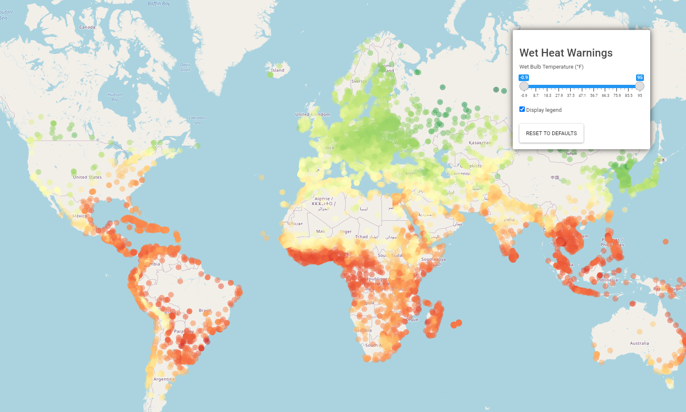

# WetHeatWarnings

### Purpose
Uses R to visualize a weather data base to predict the Wet Bulb Temperatures for over 8000 cities. This has a critical application in the modern world, since climate change is quickly making many cities unlivable due to rising heat and humidity levels. 

### Design
Humans cannot survive in >95F wet bulb temperature for more than a few hours, since the body cannot sweat efficiently enough at that point to lose heat. Studies show that wet bulb temperatures as low as 79 degrees can begin to harm humans, 89 degrees can make physical labor dangerous, and temperatures about 95 degrees may require evacuation. This web app map uses data science to track the cities that may be at risk. 

### Labels

* **Red** warning indicates WBT above 95 degrees
* **Orange** warning indicates WBT above 89 degrees
* **Yellow** warning indicates WBT above 79 degrees

| Labels      | warning indicates WBT above:     |
| :---        |          ---: |
| Red      | 95 degrees   |
| Orange   | 89 degrees      |
| Yellow   | 79 degrees      |

---
Labels:
  Red: warning indicates WBT above 95 degrees
  Orange: warning indicates WBT above 89 degrees
  Yellow: warning indicates WBT above 79 degrees
---

### [**Live on shinyapps.io!**](https://michaelvega.shinyapps.io/WetHeatWarnings/)



```Note:``` WBT (Wet Bulb Temperature) measured in Fahrenheit. 
